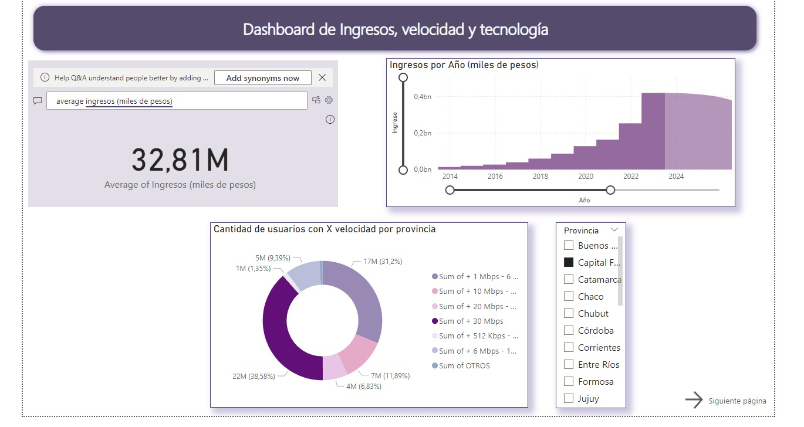

# PI_02

¡Buenas a todo el equipo de corrección! 
Este proyecto está dividido en 2 partes. La primera, el EDA, en formato Notebook. Y la segunda, el Dashboard, realizado en PowerBI

Utilicé las librerías Pandas, Matplotlib y Seaborn para realizar el EDA (Análisis Exploratorio de Datos).
Comencé cargando el Excel de 'Internet' en una variable, para luego, iterar sobre cada hoja y guardar cada una en un DF separado, esto lo hice para facilitar el análisis. Las hojas, las seleccioné basándome en el Diccionario de Datos que nos brindaron. Elegí las que me parecieron relevantes para el análisis. 

Luego, con los DF ya cargados correctamente, procedí con un análisis estadístico básico, obteniendo la media, la desviación estándar, y los valores máximos y mínimos de cada columna. 
Después, realicé 2 funciones que iteraban sobre cada hoja del DataFrame original, una para obtener todos los valores nulos de cada columna y la otra, para obtener los valores duplicados. Los nulos, los rellené con 0. Pues consideré que al ser muchos, si los eliminaba, iba a alterar el proceso de graficar. No encontré duplicados, así que continué con los outliers. Graficándolos con Scatterplots. 

Cuando terminé con los outliers, continué graficando los demás DF. 
Para todo esto, utilicé una paleta de colores seleccionada por mi. Logrando armonía y haciendo que los gráficos se vean más estéticos. 

Debajo de los gráficos, dejé mi análisis de ellos. 

Llegando al final del EDA. Llegué a la conclusión de que la compañía, presentó un incremento de clientes en los últimos 9 años, pero no uno muy grande. Ya que en lugares como el interior de Buenos Aires, o el interior del país (otras provincias), se presenta competencia, posiblemente cooperativas locales, u otras empresas de servicios de internet/cable. Además de la competencia, otro factor que influye en la cantidad de clientes, es que no en todas las provincias se encuentra la tecnología más moderna, por lo que la gente no puede acceder a altas velocidades de internet por parte de nuestra compañía.

Para el dashboard interactivo, elegí utilizar PowerBI, ya que es una herramienta previamente conocida, y para ello también me basé en varias paletas de colores. Utilizando principalmente tonos violetas y azules, para los KPI decidí cambiar un poco, para que sea mas distintivo. Para esto utilicé amarillos/dorados.